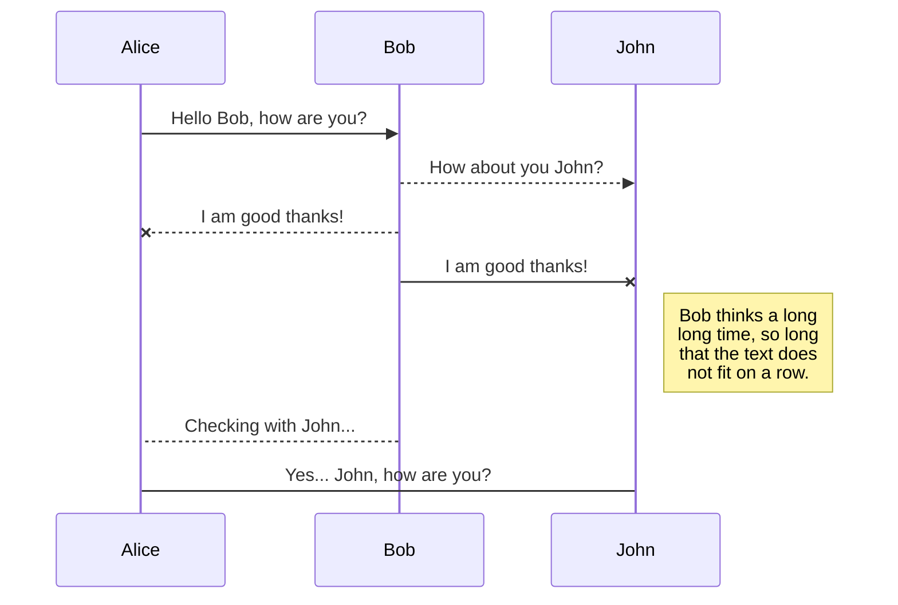

# Terms of Reference Guidelines
## 1. Purpose of the document
The Terms of Reference (ToR) document is created based on initial contact with the project partner or partners. It can be produced by any member of the Research Software Engineering (RSE) team, though it will usually be created by the team member occupying the Research Software Analyst role. It is not intended to be a customer facing document but rather a record for the RSE team of the main requirements and will be used for referral during the early stages of the project.

If the RSE team choose to adopt a **Project Planning Approval** stage, the information in this document can be used to inform decisions about whether or not the research fits well with your institutional goals and your team remit.

At a minimum it should cover the high-level concept in sufficient detail to discuss the appropriate technical and management strategies with entire RSE team at the **Feasibility** stage.

Although each section is discrete, there will inevitably be overlapping details and priorities between the sections.



And this will produce a flow chart:

```mermaid
graph LR
A[Square Rect] -- Link text --> B((Circle))
A --> C(Round Rect)
B --> D{Rhombus}
C --> D
<!--stackedit_data:
eyJwcm9wZXJ0aWVzIjoidGl0bGU6IFRlcm1zIG9mIFJlZmVyZW
5jZSBHdWlkYW5jZVxuYXV0aG9yOiBOZWlsIEpha2VtYW5cbmRh
dGU6ICcyMDE4LTExLTI4J1xuIiwiaGlzdG9yeSI6WzEyMzgyMz
Y2NTYsLTExNzg4MjA3MDIsLTEyMzY3MTAwNjQsLTE3NzI5MTk2
MTQsNjc3NjA0OTA4XX0=
-->